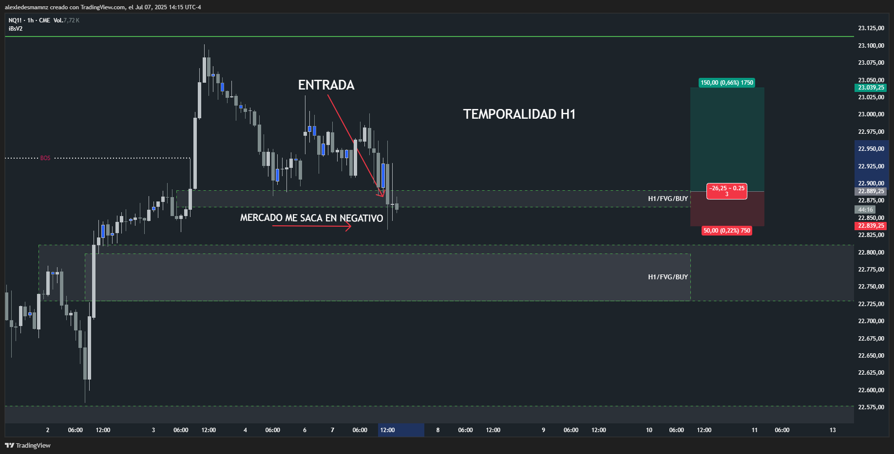
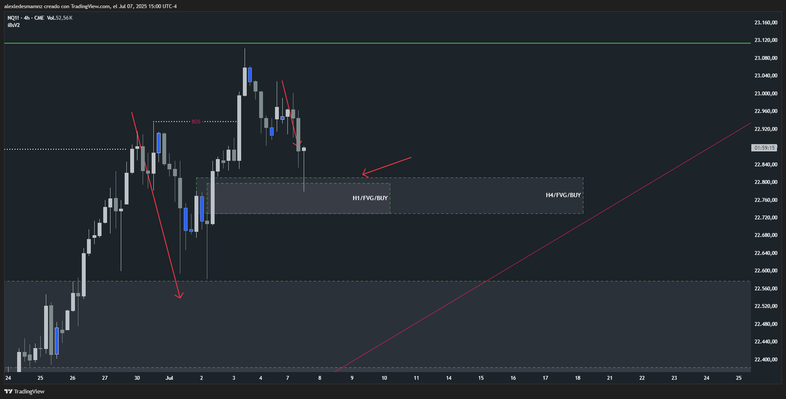

# 📅 Fecha del Trade: 07/07/2025
# 📊 Trade en vivo #001 - Nasdaq 100 (NQ)

[Ver video - http://bit.ly/40yMHf2]

## 📈 Detalles de la Operación
| Parámetro       | Valor               |
|----------------|---------------------|
| **Zona Entrada** | 22889.50 |
| **Zona Salida**  | 22839.00 |
| **Riesgo**       | 50 PTS  |
| **Beneficio**    | operación negativa |
| **Ratio R/R**    | 1:3             |

## 🎯 Análisis Técnico

Como se puede ver tanto en H1 como en H4 la operación fue tomada a favor del BOS an ambas temporalidades y alcanzó 72 puntos hasta que se desplomó sacándome en negativo induciendo el FVG H4 que está más abajo, mismo bloque que a su vez tiene dentro un FVG H1. 

Claramente aquí la zona más importante es el FVG H4 (tiene más peso a nivel macro y estructural que H1) y tomando en cuenta que los lunes casi siempre son días para sacar liquidez podría decir que técnicamente fue un buen trade, pero voy a quitarle puntos por el incorrecto manejo emocional, subestimé el retroceso a la baja en un día de sacada de liquidez, de hecho analicé todo eso antes de operar así que le quitaré otro punto a la operativa, la voy a calificar con 3 estrellas, debo mejorar lo mencionado en este análisis.

## 📌 Lecciones Clave
1. La paciencia en zonas de origen aumenta probabilidad
2. Los bloques FVG con volumen son altamente confiables
3. El riesgo controlado permite soportar volatilidad

## 💡 Reflexión Final
*"El mercado recompensa la disciplina en zonas clave más que la frecuencia operativa"*

---

🔍 **Ver análisis completo**: (http://bit.ly/3GAVTst)

PD: Siempre tuve razón... 

