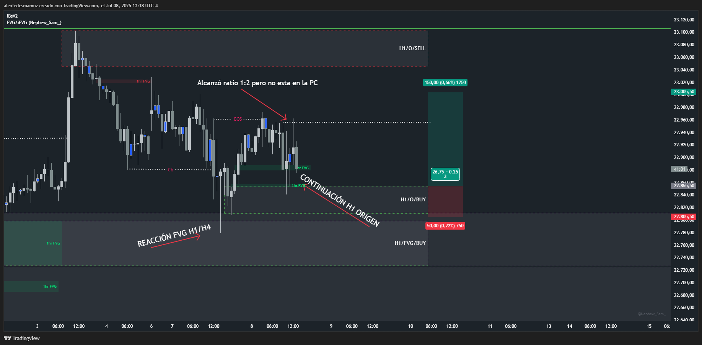

# 📅 Fecha del Trade: 08/07/2025
# 📊 Trade en vivo #002 - Nasdaq 100 (NQ)

[Ver video - https://cutt.ly/ArUpOoum]

 <!-- Asegúrate que el nombre coincida exactamente -->

## 📈 Detalles de la Operación
| Parámetro       | Valor               |
|----------------|---------------------|
| **Zona Entrada** | 22,855.50 |
| **Zona Salida**  | 22915.00 |
| **Riesgo**       | 50 PTS |
| **Beneficio**    | 52 PTS |
| **Ratio R/R**    | 1:3        |

## 🎯 Análisis Técnico

Trade de continuación en Origen H1 con BOS generado por la reacción alcista en FVG H4/H1, no tengo permitido en mi trading plan salir del mercado con menos de 100 puntos, pero estaba lejos de la PC cuando alcanzó el 1:2, la operación sigue abierta respetando el contexto general, el cual a nivel macro está bastante claro pero a nivel micro con la lateralización y el leve retroceso de semanal generan cierta incertidumbre, pero en el trading no existen los "escenarios perfectos" sino los escenarios altamente probables, si fuera por incertidumbre no operaríamos nunca. 

## 📌 Lecciones Clave

Mantener operaciones de continuación en Origen H1 con BOS respetando el contexto macro a pesar de micro-lateralizaciones

Implementar sistemas de alerta para objetivos 1:2 cuando no se está frente a la pantalla

Operar escenarios altamente probables sin buscar condiciones perfectas ante retrocesos semanales

## 💡 Reflexión Final

*"El trading se ejecuta en probabilidades, no en perfección; mantener posiciones en Origen H1/BOS requiere convicción macro y soluciones técnicas para gestionar ausencias"*

---

🔍 **Ver análisis completo**: [https://cutt.ly/hrUpUAuR]

PD: Cerré la posición con 52 puntos de profit en los 22915.00 porque ya había alcanzado el 1:2 y se estaba regresando... llegó a subir hasta los 82 puntos pero con la baja volatilidad y la liquidez bajando a partir de las 2:30pm no valía la pena aguantar la posición más tiempo, a partir de ahora pondré alertas para no descuidar el mercado mientras hago otras cosas.