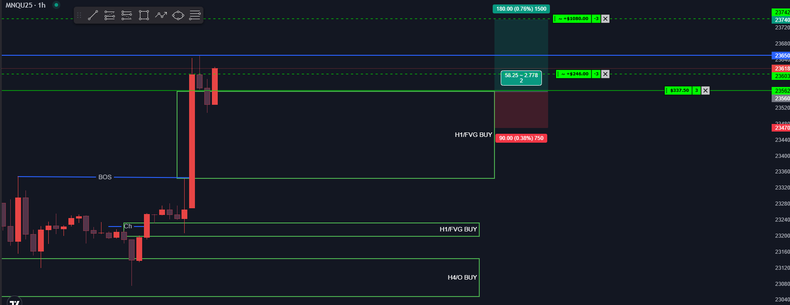

# 📅 Fecha del Trade: 22/08/2025
# 📊 Trade #006 - Nasdaq 100 (MNQ)

 <!-- Asegúrate que el nombre coincida exactamente -->

## 📈 Detalles de la Operación
| Parámetro       | Valor               |
|----------------|---------------------|
| **Zona Entrada** | 22956.00 |
| **Zona Salida**  | 23047.25 |
| **Riesgo**       | 50 PTS |
| **Beneficio**    | 92 PTS |
| **Ratio R/R**    | 1:2        |

🎯 Análisis Técnico

El mercado venía de zona de vendedores y se veía muy comprimido a la baja y sin una dirección clara, tenía un FVG H1 válido al alza y lo dejé pasar por no tener una idea clara de qué estaba pasando realmente, mercado rompe al alza y me arriesgo a tomar ese FVG H1 sacando 42 puntos como ganancia parcial con tres contratos.

🧠 Análisis Estratégico

La operación demostró una gestión adaptativa al flujo del mercado. Aunque inicialmente se dejó pasar el FVG por falta de claridad, la ruptura alcista posterior confirmó la fuerza compradora. El uso de tres contratos permitió una gestión de riesgo escalonada, tomando ganancias parciales mientras se mantiene exposición controlada al movimiento.

📉 Análisis de Comportamiento del Precio

El mercado mostró un claro agotamiento de vendedores en zona de compresión, seguido por una ruptura alcista con convicción. El FVG en H1 funcionó como soporte dinámico y zona de re-aceptación de precios. La reacción inmediata al alcanzar esta zona confirmó la presencia de compradores activos, validando el setup operacional.

📌 Lecciones Clave

La adaptabilidad ante cambios de escenario es crucial

Los FVG en marcos H1 ofrecen entries de alta probabilidad

La gestión escalonada maximiza oportunidades en movimientos extendidos

💡 Reflexión Final

"La flexibilidad estratégica complementa la disciplina, permitiendo capturar oportunidades en entornos dinámicos"

---

🔍 **Ver análisis completo**: [Estrategia.md](estrategia.md) | [Datos brutos](/data/trade_009.csv)