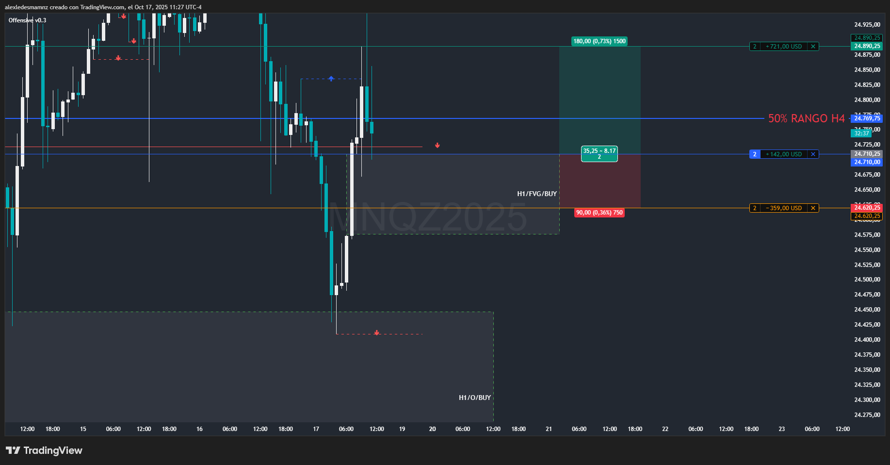
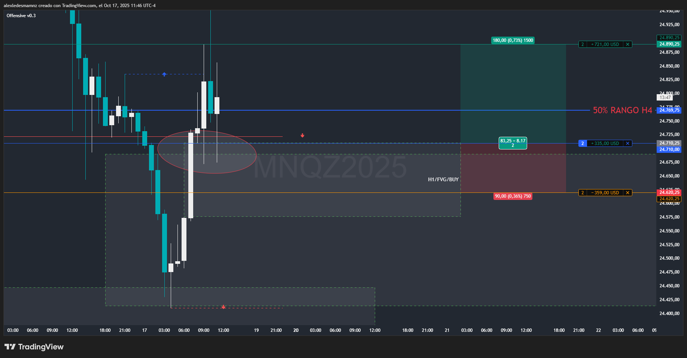
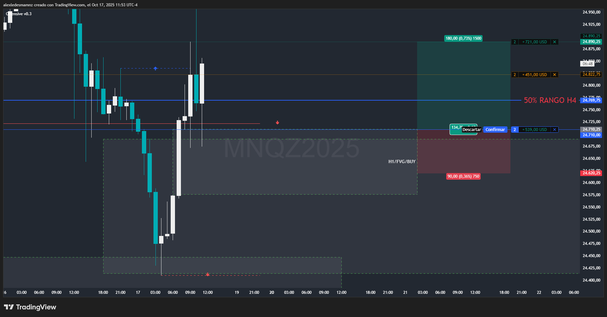

# 📅 Fecha del Trade: 17/10/2025
# 📊 Trade #015 - Nasdaq 100 (MNQ)

 <!-- Asegúrate que el nombre coincida exactamente -->
 <!-- Asegúrate que el nombre coincida exactamente -->
 <!-- Asegúrate que el nombre coincida exactamente -->

El Origen H1 no es técnicamente un Origen, pero está haciendo de soporte apoyado en un imbalance semanal de compras, la reacción en esta zona generó un FVG H1 el cual aproveché para posicionarme en largo.

Destacar también que este FVG H1 está a favor de un Origen H4, pude haber esperado el trade en H4 pero me decidí por el FVG H1.

---

